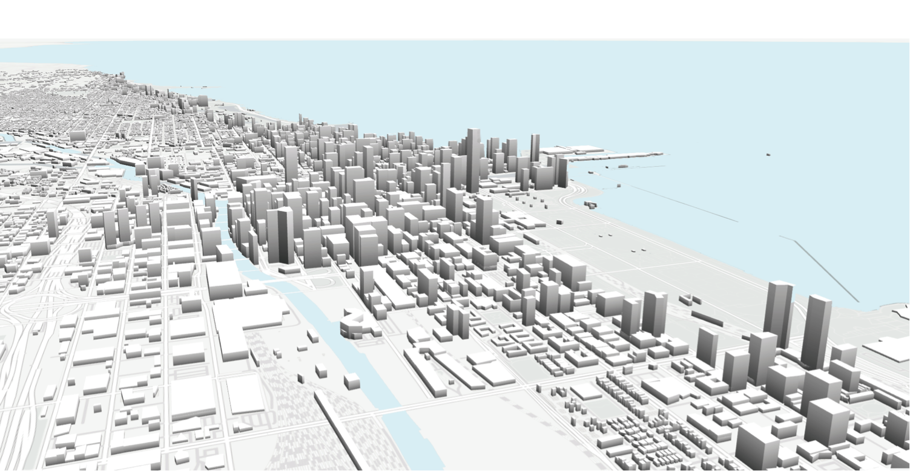

### Urban Analytics and Planning

Copyright (c) 2017 Paul Waddell

This is an early draft of a set of notes for a graduate course in land and housing markets in the city and regional
planning department at the University of California, Berkeley.  My aim is to evolve it into a full book draft, for
online use with interactive data, analytics, and maps.

